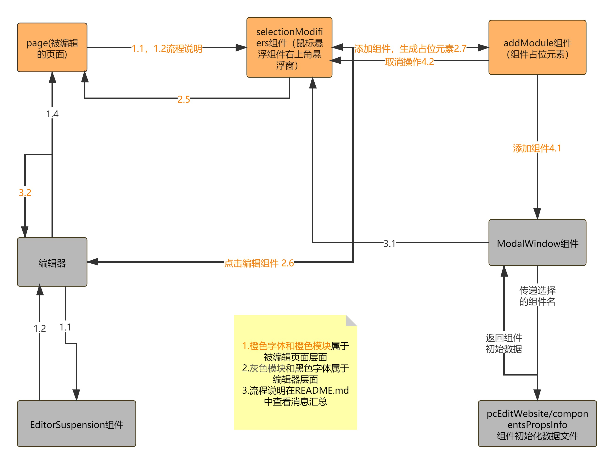

# PC 官网及建站 & Wap(北京移动官网、上海移动官网)

### 安装依赖项

```
npm install
```

### 运行项目

```
npm run start
```

### 打包项目

```
npm run build
```

## ui 框架插件等

---

material-ui: [官网地址](https://material-ui.com/zh/)

antd-ui: [官网地址](https://ant.design/components/overview-cn/)

ant-Motion 动画组件: [官网地址](https://motion.ant.design/components/scroll-anim-cn#components-scroll-anim-demo-parallax)

braft-editor 富文本编辑器:

1. [国内镜像说明地址](https://codechina.csdn.net/mirrors/margox/braft-editor?utm_source=csdn_github_accelerator)
2. [gihub 说明地址](https://github.com/margox/braft-editor)

pubsubjs：[gihub 说明地址](https://github.com/mroderick/PubSubJS)

---
## 目前开发逻辑

1. 除活动页，其他 views 作为页面视图，负责聚合组件形成完整页面视图
   - components 存放页面中提取的组件
   - assets 存放静态资源
   - public 提取常用的可复用逻辑或可复用数据
   - views 页面视图
   - router 当前文件夹下的所有路由
2. 活动页开发，活动页组件复用性不高，views 内的每一个文件夹下的 index 就是一个页面视图
   - assets 存放静态资源，一个页面对应一个文件夹
   - router 活动页路由
   - views 一个文件夹下 index.js 对应一个页面视图，组件存放在文件夹下

---
## 路由详情说明

#### 一级路由

1. 路径： src/router/router.js
   - 用于区分 H5 官网及 H5 活动页、pc 官网、pc 建站

#### 二级路由

1. pc 官网路由 路径：src/pc/router.js
2. pcEdit 建站路由 路径：src/pcEditWebsite/views/index.js
3. H5 路由 路径：src/wap/control/index.js
   - 用于区分活动页面路由、北京 H5 官网路由、上海 H5 官网路由

#### 三级路由

1. H5 活动页路由：src/wap/activityPages/router/index.js
2. H5 北京官网路由：src/wap/beijing/router/index.js
3. H5 上海官网路由：src/wap/shanghai/router/index.js

---


## 线上地址

> 网站做了识别设备 pc，移动。如果需要访问 wap 页面请模仿移动设备输入地址

1. [pc 官网首页](https://pc.jzsyishu.com/site/pc/home)：https://pc.jzsyishu.com/site/pc/home
2. [wap 北京官网首页](https://pc.jzsyishu.com/site/wap/beijing/home)：https://pc.jzsyishu.com/site/wap/beijing/home
3. [wap 上海官网首页](https://pc.jzsyishu.com/site/wap/shanghai/home)：https://pc.jzsyishu.com/site/wap/shanghai/home
4. [pc 建站](https://pc.jzsyishu.com/site/pcEdit)：https://pc.jzsyishu.com/site/pcEdit
   - 切换密码登录 账号：jzs 密码：88888888
5. 活动页地址前缀：https://pc.jzsyishu.com/site/wap/activity
   - 如[钢琴页](https://pc.jzsyishu.com/site/wap/activity/pianoShow)：https://pc.jzsyishu.com/site/wap/activity/pianoShow

---

## 网站订阅发布消息汇总
### 1. 在编辑模式下会为页面中每一个组件套一个壳（pc/publicjs/index.js）
- 1.1 发布changeSelectionPosition - 传递当前壳位置信息，使组件右上角操作悬浮窗位置更改
- 1.2 发布getActiveObj - 传递activeObjInfo 传递：num当前悬浮组件的下标、componentJson当前页面所有组件json、type当前页面唯一标识、isContainer是否是组件容器
### 2. 悬浮窗控件组件涉及的消息（pc/components/common/selectionModifiers）
- 2.1 订阅changeSelectionPosition - 更改悬浮窗位置
- 2.2 订阅getActiveObj - 获取选中组件的json传递给悬浮窗内
- 2.3 订阅addComponent - 添加组件时 接收新增组件数据并删除组件占位元素
- 2.4 订阅deleteAddModule - 删除当前修改页面componentJson中的组件占位元素
- 2.5 发布getChangeComponentData - 添加、删除、上移、下移操作后  同步当前操作页面的componentJson更新视图（直接在悬浮控件组件窗层面解决，不通过编辑器）
- 2.6 发布selectPageComponent - 点击编辑组件传递给编辑器当前的activeObjInfo  1上面有解释
- 2.7 点击添加组件时，在componentJson中插入AddModule占位组件，并使用2.5流程更新视图

### 3. pc/views下的每一个视图文件都有getChangeComponentData订阅消息 
- 3.1 订阅getChangeComponentData - 接收传来的componentJson，使用唯一标识对比是否对应当前页面的标识，并更新视图
- 3.2 发布operationMessage - 负责发给编辑器提示信息，在编辑器层面显示提示信息，常用替换componentJson时发送成功or失败信息
### 4. 组件占位元素 - 点击增加组件时出现（pc/components/common/addModule）
- 4.1 发布showModalWindow - 点击添加组件唤醒 组件列表悬浮窗
- 4.2 发布deleteAddModule - 取消页面中的占位元素

## 编辑器订阅发布消息汇总
### 1. 编辑器（pcEditWebsite/views/editor.js）
- 1.1 订阅selectPageComponent - 接收传递来的activeObjInfo，再通过里面选中的下标筛选出选中的组件数据，通过props传递给`<EditorSuspension/>`组件编辑器并通过 组件名寻找对应组件编辑器在容器中显示
- 1.2 订阅revisedDataList - 接收修改后的组件数据替换后形成新的componentJson（这时最新数据还在编辑器层面，然后会通过1.4同步给被编辑的页面）
- 1.3 订阅operationMessage - 在编辑器层面 ，操作回显提示
- 1.4 发布getChangeComponentData - 传递给页面新的componentJson更新视图

### 2. 悬浮模块窗（pcEditWebsite/components/modalWindow/index.js）
- 2.1 订阅showModalWindow - 接收控制模态床是否显示 及 设置显示模块（组件列表、设置）

### 3. 悬浮模块窗中 组件列表模块（pcEditWebsite/editorComponents/modalWindow/componentsModal/index.js）
- 3.1 发布addComponent - 传递添加组件的信息及默认数据
- 3.2 发布addComponentContainer - 传递组件信息给组件容器添加


### 建站消息大致图



# 官方基础说明

This project was bootstrapped with [Create React App](https://github.com/facebook/create-react-app).

## Available Scripts

In the project directory, you can run:

### `npm start`

Runs the app in the development mode.\
Open [http://localhost:3000](http://localhost:3000) to view it in the browser.

The page will reload if you make edits.\
You will also see any lint errors in the console.

### `npm test`

Launches the test runner in the interactive watch mode.\
See the section about [running tests](https://facebook.github.io/create-react-app/docs/running-tests) for more information.

### `npm run build`

Builds the app for production to the `build` folder.\
It correctly bundles React in production mode and optimizes the build for the best performance.

The build is minified and the filenames include the hashes.\
Your app is ready to be deployed!

See the section about [deployment](https://facebook.github.io/create-react-app/docs/deployment) for more information.

### `npm run eject`

**Note: this is a one-way operation. Once you `eject`, you can’t go back!**

If you aren’t satisfied with the build tool and configuration choices, you can `eject` at any time. This command will remove the single build dependency from your project.

Instead, it will copy all the configuration files and the transitive dependencies (webpack, Babel, ESLint, etc) right into your project so you have full control over them. All of the commands except `eject` will still work, but they will point to the copied scripts so you can tweak them. At this point you’re on your own.

You don’t have to ever use `eject`. The curated feature set is suitable for small and middle deployments, and you shouldn’t feel obligated to use this feature. However we understand that this tool wouldn’t be useful if you couldn’t customize it when you are ready for it.

## Learn More

You can learn more in the [Create React App documentation](https://facebook.github.io/create-react-app/docs/getting-started).

To learn React, check out the [React documentation](https://reactjs.org/).

### Code Splitting

This section has moved here: [https://facebook.github.io/create-react-app/docs/code-splitting](https://facebook.github.io/create-react-app/docs/code-splitting)

### Analyzing the Bundle Size

This section has moved here: [https://facebook.github.io/create-react-app/docs/analyzing-the-bundle-size](https://facebook.github.io/create-react-app/docs/analyzing-the-bundle-size)

### Making a Progressive Web App

This section has moved here: [https://facebook.github.io/create-react-app/docs/making-a-progressive-web-app](https://facebook.github.io/create-react-app/docs/making-a-progressive-web-app)

### Advanced Configuration

This section has moved here: [https://facebook.github.io/create-react-app/docs/advanced-configuration](https://facebook.github.io/create-react-app/docs/advanced-configuration)

### Deployment

This section has moved here: [https://facebook.github.io/create-react-app/docs/deployment](https://facebook.github.io/create-react-app/docs/deployment)

### `npm run build` fails to minify

This section has moved here: [https://facebook.github.io/create-react-app/docs/troubleshooting#npm-run-build-fails-to-minify](https://facebook.github.io/create-react-app/docs/troubleshooting#npm-run-build-fails-to-minify)
